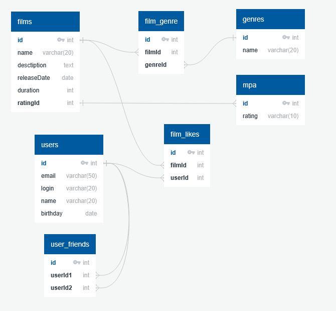

# java-filmorate
Template repository for Filmorate project.

Спроектированная база данных  
Примеры запросов:  
        Получение всех фильмов:    
SELECT * FROM films  

        Получение всех пользователей:  
SELECT * FROM users  

        Получение топа фильмов:  
SELECT f.id,  
        f.name,  
        f.desctiption,   
        f.releaseDate,  
        f.duration,  
        m.rating,  
        COUNT(fl.filmId)  
FROM films AS f  
INNER JOIN mpa AS m ON f.ratingId = m.id  
INNER JOIN film_likes AS fl ON f.id = fl.filmId  
GROUP BY fl.filmId   
ORDER BY COUNT(fl.filmId) DESC   
LIMIT 10;  

